# Slightly Improved Screenshot

A tiny macOS menu bar utility that extends the built-in screenshot workflow with
fixed-size frames for social media. Press the hotkey, a frame locked to the chosen
preset follows your mouse, click to capture. The result is copied to the clipboard
and saved to `~/Downloads` at the exact pixel size the platform expects.



## Install

```bash
curl -fsSL https://realworldbuilder.github.io/slightly-improved-screenshot/install.sh | bash
```

Downloads the latest release, installs it to Applications, and launches it. Requires
macOS 26 or later. The release is ad-hoc signed and not notarized, so use the command
rather than downloading the zip in a browser.

## Presets

| Preset | Pixels |
|---|---|
| X / Twitter | 1600 × 900 |
| Instagram Square | 1080 × 1080 |
| Instagram Portrait | 1080 × 1350 |
| Instagram Story | 1080 × 1920 |
| LinkedIn | 1200 × 627 |
| Open Graph | 1200 × 630 |

## Using it

**⇧⌘2** (rebindable in Settings) or the menu bar icon opens the capture overlay, which
works like the built-in Screenshot app:

- A floating toolbar at the bottom of the screen has a screenshot / video switch, a
  button for each preset, an **Options** menu (save to Downloads, copy to clipboard,
  what to do when a size does not fit, timer, mouse pointer, and for video the
  microphone, system audio and mouse clicks), and a **Capture** / **Record** button.
- The frame is fixed to the preset's size. **Drag** it into place, or click anywhere to
  bring it there. **Arrow keys** nudge by 1 px, **Shift + arrows** by 10 px.
- **1 to 6** switch presets from the keyboard.
- **Capture**, **Return**, or a **double-click** inside the frame takes the shot.
  **Esc**, the close button, or right-click cancels.
- The frame reopens where you left it.

Output is an opaque sRGB PNG at 72 DPI with exactly the preset's pixel dimensions.

## Video

Switch the toolbar to video and press **Record**. The frame is recorded at the preset's
pixel size as an H.264 MP4 at up to 60 fps (odd dimensions are rounded up to even, so
LinkedIn records at 1200 × 628). A red outline marks the recorded region and is not part
of the recording. Stop with the **Stop** button
beside the region (it shows the elapsed time), the hotkey, or the menu bar item.

- **Record System Audio** captures what the Mac is playing.
- **Microphone** adds any connected input. System audio and the microphone are mixed
  into a single audio track so the file plays everywhere.
- The recording is saved to `~/Downloads` and, with Clipboard on, copied as a file.
- **Timer** (5 or 10 seconds) applies to screenshots and recordings; press the hotkey
  during the countdown to cancel.

The first recording with a microphone asks for **Microphone** access.

On a Retina display the frame is drawn at `pixels / scale` points so the capture is
pixel-for-pixel. When a preset does not fit on the display (for example a 1080 × 1920
story on a 1080 px tall 1x monitor) the frame is scaled down to fit and the capture is
upscaled to the exact preset size. The label turns orange and shows the scale.
Options can switch this to exact pixels only.

## Requirements

- macOS 26 or later (uses the ScreenCaptureKit screenshot API introduced in macOS 26).
- Xcode 26.3, [xcodegen](https://github.com/yonaskolb/XcodeGen) (`brew install xcodegen`).
- An Apple Development signing identity. The Screen Recording permission is keyed to the
  code signature, so a consistently signed build keeps its grant across rebuilds.

## Build and install

```bash
make run
```

This regenerates the Xcode project, builds Release, installs to `~/Applications`,
and launches the app. Other targets: `make build`, `make test`, `make install`,
`make release` (ad-hoc signed zip for GitHub Releases),
`make reset-tcc` (forget the Screen Recording grant to re-test first launch), `make clean`.

The first launch asks for **Screen Recording** access. Grant it in
System Settings › Privacy & Security › Screen & System Audio Recording, then relaunch.

## Layout

```
Sources/
  App/        App entry, delegate, AppState (capture pipeline orchestration)
  Model/      Preset and FitPolicy enums, UserDefaults-backed PresetStore
  Hotkey/     KeyboardShortcuts registration
  Overlay/    FrameGeometry (pure math), OverlayWindow/View/Controller, CaptureToolbar (SwiftUI), RegionIndicatorWindow
  Capture/    ScreenCaptureKit capturers (macOS 26 rect API, legacy filter API), ScreenRecorder, permission helpers
  Output/     sRGB normalization, PNG encoding, audio mixdown, clipboard and Downloads writing
  Settings/   SwiftUI settings window
Tests/        FrameGeometry unit tests (Swift Testing)
```

## License

MIT. See [LICENSE](LICENSE).
